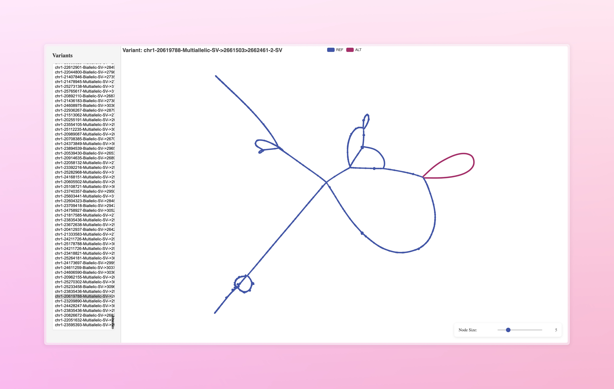

## Graph Layout and Visualization for GFA Files with FM3 algorithm

### Introduction

Enter a GFA file, then specify variants, it will locate it and achieve cool visualization.

This is very practical and efficient for displaying variation or website presentation.

### DEMO


### Live demo
[1KCP](https://yanglab.westlake.edu.cn/1kcp/dataview/chr10-18041612-Multiallelic-SV-%3E170356588%3E170356673-1-SV?q=chr10-18041612-Multiallelic-SV-%3E170356588%3E170356673-1-SV&current=1)

### Installation

```bash
git clone https://github.com/JianYang-Lab/fm3-gfa.git
cd fm3-gfa
cargo build --release
```

### Usage

#### 1. generate all json files

```bash
./target/release/fm3-gfa generate --gfa test.gfa --vcf test.1000.vcf.gz > test.all.json.tsv
```


#### 2. Start a web server

```bash
./target/release/fm3-gfa serve --gfa test.gfa --vcf test.1000.vcf.gz --port 8888
Server running at http://localhost:8888
```

Enjoy the visualization at http://localhost:8888


### Maintainer

Wenjie Wei: Developement

Yifei Wang: Concept and test data
